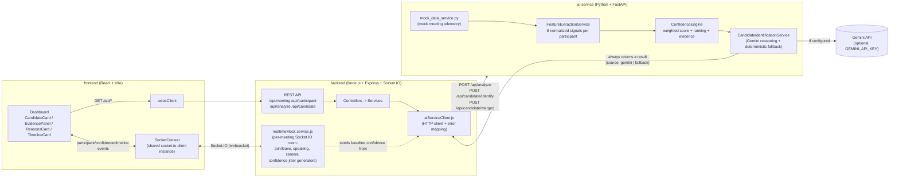

# Architecture

Sherlock's candidate-identification prototype is three independently
runnable services. Each has a single, narrow responsibility, and each
degrades gracefully if the ones around it are unavailable.

```
frontend (React)  <-- REST + Socket.IO -->  backend (Node/Express)  <-- REST -->  ai-service (FastAPI)
   Dashboard UI          hydration/          gateway + domain              Feature Extraction
                          realtime events     services + Socket.IO         Confidence Engine
                                               room broadcaster             Gemini Identification
```

## 1. System diagram



## 2. Request/response flow — "who is the candidate?"

1. **Telemetry in.** The AI service either receives raw meeting
   telemetry (`MeetingData`: per-participant expected vs. observed
   identity, join time, speaking activity, camera time, transcript
   stats, face-detection sampling) or falls back to its built-in mock
   meeting when none is supplied.
2. **Feature Extraction Service** (`feature_extraction_service.py` +
   `scorers.py`) turns that raw telemetry into 8 independent,
   `[0, 1]`-normalized signals per participant: display-name
   similarity, email similarity, speaking-duration health, speaking
   -frequency health, join-time promptness, camera-presence ratio,
   transcript quality, and face-presence ratio. Every scorer is a pure
   function with no AI/ML model involved — deterministic and
   independently testable.
3. **Candidate Confidence Engine** (`confidence_engine.py`) combines
   the 8 signals into one weighted `confidenceScore` per participant
   (weights are configurable, default in `core/config.py`), ranks every
   participant highest-first, and produces an `evidence` breakdown
   (`rawScore`, `weight`, `contribution` per feature) plus a rule-based
   `reasonSummary`. This step never calls an LLM — it is the fully
   deterministic, auditable backbone of the system.
4. **Candidate Identification Service** (`candidate_identification_service.py`)
   adds an LLM reasoning layer on top: it hands Gemini the meeting
   metadata, the feature vectors, and the Confidence Engine's ranking,
   and asks it to name the candidate, explain why, list plausible
   alternatives, and score its own uncertainty. If `GEMINI_API_KEY` is
   unset, the Gemini call fails, or the response can't be parsed, the
   service **never raises** — it falls back to a deterministic pick
   derived straight from the Confidence Engine's own top-ranked
   participant, with uncertainty computed from how close the top two
   scores are. Every `/api/candidate/*` route is fully exercisable with
   zero external dependencies.
5. **Candidate Merge Service** reconciles the Confidence Engine's
   evidence trail with the Identification Service's pick into one
   flattened shape (`candidate`, `confidence`, `reason`, `evidence`,
   `llmExplanation`, `uncertainty`, `alternativeCandidates`), which is
   what the Node backend and frontend actually consume.
6. **Node backend** (`aiServiceClient.js` + `analysis.service.js` /
   `candidate.service.js`) calls the AI service over HTTP, validates
   the response shape, and maps any failure (timeout, connection
   refused, malformed body) to a typed `ApiError` rather than leaking
   axios internals to callers.
7. **Realtime layer.** `realtimeMock.service.js` seeds each
   participant's live confidence score from the AI service's last
   computed ranking, then broadcasts small, bounded jitter updates over
   Socket.IO on a fixed cadence (along with join/leave, speaking, and
   camera events), all reshaped into one normalized `timeline:event`
   feed. This is what makes the confidence score feel "continuously
   updating" during a live interview without every client needing to
   poll REST endpoints.
8. **Frontend.** `SocketContext` opens one shared socket per session;
   `useCandidate` / `useParticipants` / `useTimelineEvents` hydrate
   from REST on load and then patch themselves from the matching socket
   events. `CandidateCard`, `EvidencePanel`, and `ReasonsCard` render
   the identified candidate, the raw evidence table, and the
   plain-language explanation side by side, so a viewer can see both
   the answer and *why*.

## 3. Why three services instead of one

- **ai-service** is the only place that knows about scoring heuristics
  or the LLM. It has no knowledge of Express, Socket.IO, or the
  frontend — it's a pure "meeting telemetry in, candidate + confidence
  + explanation out" HTTP service, so it can be swapped, scaled, or
  replaced independently (e.g. with a real ML model later) without
  touching the rest of the stack.
- **backend** owns the realtime/session concerns (Socket.IO rooms,
  connection lifecycle, request validation, error normalization) and
  is the only service the frontend talks to directly. It never
  duplicates scoring logic — it's a thin, typed gateway in front of
  the AI service.
- **frontend** only renders what it's given. It has no scoring logic
  of its own, which keeps "why did the system pick this person" fully
  traceable back to the AI service's evidence trail.

## 4. Data model (mocked, would be replaced by real integrations)

In production, "expected identity" would come from Sherlock's calendar
integration (candidate name/email, interviewer names) and "observed
identity" / audio / video / transcript would come from the meeting
platform's SDK (Google Meet / Zoom / Teams). This prototype models both
sides with the same shape (`MeetingData` in `ai-service/app/models/schemas.py`)
so swapping the mock generator for a real data source requires no
changes to the scoring, confidence, or identification layers.

## 5. Scalability notes

This prototype runs as a single process per service, which is the
right tradeoff for a challenge submission but has real limits worth
being explicit about:

- **Socket.IO state is process-local today.** `realtimeMock.service.js`
  keeps its per-meeting session map (`sessions`) in memory on one Node
  process. Running more than one backend instance behind a load
  balancer would split a given meeting's room across instances
  inconsistently. The standard fix — the
  [Socket.IO Redis adapter](https://socket.io/docs/v4/redis-adapter/)
  plus moving `sessions`/`confidenceScores`/etc. into Redis — is a
  drop-in swap at the `sockets/` boundary and doesn't require changing
  the event contract the frontend already depends on.
- **The AI service is already stateless and horizontally scalable.**
  Every route in `ai-service/app/api/*` takes its full input on each
  request and holds no session state between calls, so it can be
  scaled to N replicas behind a load balancer with zero code changes —
  this was a deliberate design choice (see `confidence_engine.py` /
  `feature_extraction_service.py` docstrings: "stateless — safe to
  instantiate once and share").
- **The Node backend's roster/meeting state is in-memory and
  single-instance.** `meeting.service.js` and `participant.service.js`
  hold their mock data as module-level variables. Moving this to a
  real datastore (Redis for hot session state, Postgres for anything
  that needs to survive a restart) is the next step before running
  more than one backend instance — this is the same gap called out as
  "no persistence" in `EVALUATION.md` §4, just framed from a
  scale-out angle here.
- **Gemini calls are the one external, rate-limited dependency in the
  hot path.** `CandidateIdentificationService` already isolates this
  behind a client with its own timeout (`GEMINI_TIMEOUT_SECONDS`) and
  a deterministic fallback, so a Gemini-side slowdown or rate limit
  degrades to the rule-based Confidence Engine's own ranking rather
  than cascading into a full outage — the graceful-degradation path
  doubles as the scalability safety valve for that dependency.

None of the above requires a different architecture — the service
boundaries (`frontend` / `backend` / `ai-service`) were already drawn
along the lines that make each of these swaps local rather than
cross-cutting.

## 6. Deployment shape (not yet containerized)

Each service is independently deployable: `frontend` as a static build
behind a CDN, `backend` as a small Node process (stateless — see
Evaluation for the in-memory-state limitation), `ai-service` as a
FastAPI process behind Uvicorn/Gunicorn. `AI_SERVICE_URL` is the only
coupling between backend and ai-service, so they can scale
independently and the AI service could be replaced by multiple model
backends behind the same contract.
